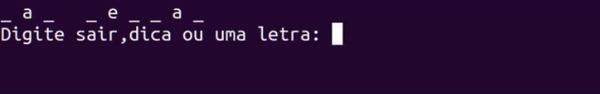

# Agenda de Contatos

Um game simples de adivinhação de palavras com implementação da Wikipedia(API).



## 🚀 Começando

Essas instruções permitirão que você obtenha uma cópia do projeto para fins de desenvolvimento e teste.

### 📋 Pré-requisitos

Programas necessarios:

```
Python 3.9
```

Bibliotecas necessarias: 

```
wikipedia 1.4.0 
```

### 🔧 Instalação

Como instalar e configurar o projeto.

Baixe e instale as bibliotecas necessarias através do PIP:

```
pip install wikipedia
```

Execute o arquivo game.py.

## 🛠️ Construído com

* [Python](https://pypi.org/project/wikipedia/) - Banco de Dados.
* [Wikipedia](https://pypi.org/project/wikipedia/) - API de request de informação.

## ✒️ Autores

* **Ruy Araujo** - *Projeto Inicial* - [github](https://github.com/Ruy-Araujo)

Você também pode ver a lista de todos os [colaboradores](https://github.com/usuario/projeto/colaboradores) que participaram deste projeto.

## 📄 Licença

Este projeto está sob a licença (MIT) - veja o arquivo [LICENSE.md](https://github.com/usuario/projeto/licenca) para detalhes.


